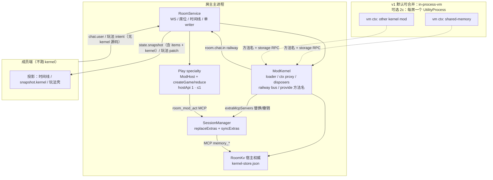
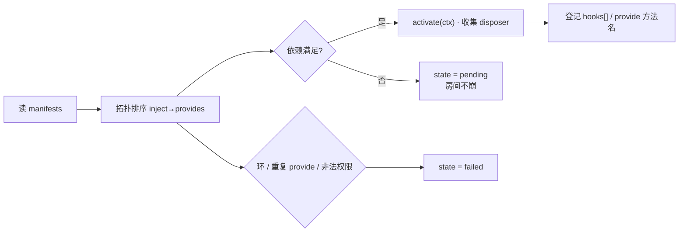
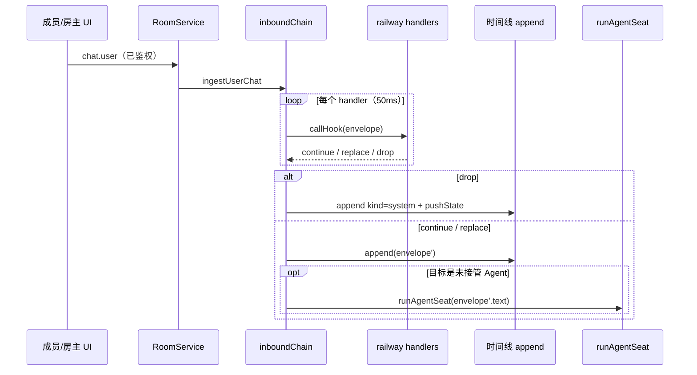
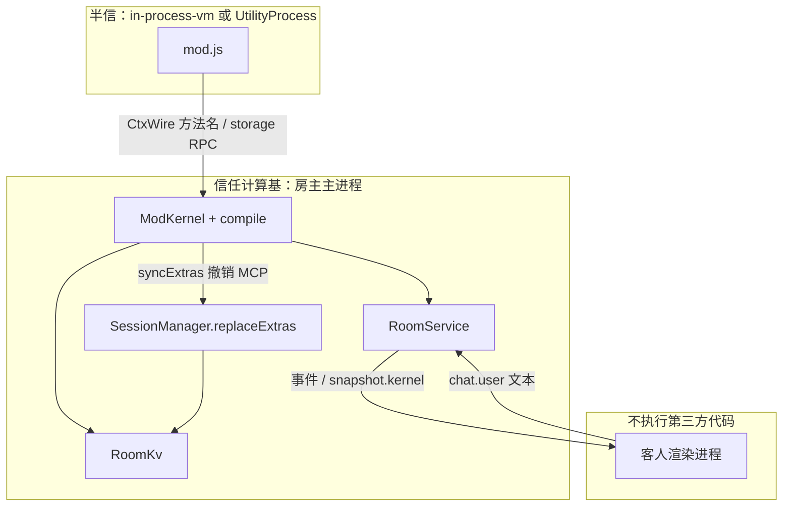

# CC Desktop Mod Kernel（hostApi: 2）设计

**作者：** TBD  
**日期：** 2026-08-17  
**状态：** Draft  
**取代：** 作为房间 Mod 的 north-star。`docs/superpowers/specs/2026-08-14-mod-system-design.md` 降级为 **hostApi: 1 玩法包 specialty** 规格，不再指导内核演进。  
**权威方向：** DSH 启发笔记（2026-08-17）— 组合层 + 分发层，不是 `createGame` / `reduce` 玩法引擎。

---

## Overview

2026-08-14 工坊规格已经落地：每间房最多一个 `hostApi: 1` 玩法包，入口是 `host.js` 的 `createGame()`，权威 reduce 跑在 `ModHost`（UtilityProcess / `node:vm`），客人入房前按 checksum 拉包，日常同步发 `mod.patch` / `mod.priv`。这条链路适合狼人杀 / 投票这类**单局状态机**，但不适合「一间房同时挂共享记忆、入站改写、以后再叠翻译 / 定时任务」的**组合**。

本期把方向钉死为方案 A：冻结 `hostApi: 1` 玩法包，另建 `hostApi: 2` **ModKernel**。内核是最小可信子集（manifest 依赖图 + disposer + railway hook + `provides`→SDK 原语编译），第一批消费者锁死为：

1. **群共享记忆**（`provides: ["memory"]`），编译成进程内 MCP，挂到该房已有 Agent 席位会话。
2. **一条最小 railway hook**：`room.chat.in`，在主机把入站聊天写入时间线 / 交给 Agent 之前改写或短路。v1 **不做** onion `next` / wrap-after-next。

执行层仍是 Claude Agent SDK 的 turn loop；组合层是我们独占的资产。客人不执行任何 hostApi: 2 代码。

---

## Background & Motivation

### 当前状态（已实现，保留）

| 层 | 实现 | 约束 |
|---|---|---|
| 玩法包校验 | `mod-package.ts` `parseManifest` / `loadModDir` | `hostApi` 必须 `=== MOD_HOST_API`（1）；`host.js` 必须；`ui.js` 拒绝；`permissions` 必须空 |
| 权威 reduce | `mod-game.ts` `createModRuntime` + `loadGameFromSource` | `node:vm` 沙箱；禁 `Math.random` / `Date.now` / `require` / `node:*` |
| 进程隔离 | `mod-host.ts` `ModHost` | 生产 UtilityProcess，测试 in-process / loopback |
| 房间接线 | `room-service.ts` `enableMod` / `dispatchMod` / `intentChain` | 每房 **一个** `modHost`；intent 单队列 |
| Agent 玩法工具 | `room-mod-agent.ts` `tryCreateRoomModMcp` | `createSdkMcpServer` → `SessionRunOpts.extraMcpServers` |
| 入房握手 | `hello` → `mod.offer` → `mod.fetch` / `mod.bundle` | 房间有 `modChecksum` 时 join 必须匹配 |
| 创建房 UI | `RoomSidebar.tsx` 单选 `packDir` | 创建后 `enableRoomMod` |
| 通用玩法壳 | `ModPlayPanel.tsx` | 公开视图 + 本席位视图 + `getActions` |
| 客人快照 | `applyGuestSnapshot` | 只拷固定字段（`members` / `seats` / `items` / `modChecksum` / …），**不会**自动收下未知字段 |
| Session extras | `SessionManager.continue` | **只加不删** `extraMcpServers` / `extraAllowedTools`；`reopenForExtras` 仅在出现**新** key 时为真 |

`packages/shared/src/room-protocol.ts` 的 `MOD_HOST_API = 1` 与 `mod-package.test.ts`「rejects hostApi: 2」是刻意的 specialty 边界，**不要拆掉**。

### 痛点

1. **玩法引擎无法组合。** `createGame` / `reduce` 假定一个权威 state。共享记忆、入站改写、翻译不是「另一局游戏」，硬塞进 reduce 会把内核变成更多 play pack。
2. **加载器不认依赖。** 今日 `listModPacks` → `loadModDir` → `parseManifest`，`hostApi !== 1` 直接抛错并被静默跳过。没有 `inject` / `provides`，也没有 pending。
3. **ctx 纪律未建立。** 玩法包的 `ctx` 是宿主塞进去的 `{ rng, now, seats, actor }`，作者不能 import 宿主，但这是 reduce 专用形状，不是可演进的 capability seam。
4. **SDK 空位未占用。** `session-manager.ts` 的 `buildQueryOptions` 在启动时静态合并 `mcpServers` / `plugins` / `hooks.Notification`。SDK **没有**运行时依赖图、级联卸载、房间作用域隔离。这是内核该填的空，不是该重写的 loop。
5. **席位 extras 不可撤销。** 今日 `continue` 合并 extras 是单向加法。`disableKernelMod` 若不改 `SessionManager` 契约，已 `start`/`continue` 过的 Agent 席位会继续持有 `mod-memory`。

### 为什么现在改 north-star

DSH / Cordis 的有效结论是：**事件流 + 可逆副作用 = 控制流**；消费者只依赖接口；缺失依赖就挂起。我们不需要完整 Fiber / epoch，但必须先有一份两三百行量级的可信加载器，否则后续多 mod 组合、换 Provider 位置、迁设备都会堵在「作者直接 import 宿主」这条路上。

---

## Goals & Non-Goals

### Goals

1. 定义 `hostApi: 2` manifest 与加载器：读包 → 按 `inject` / `provides` 拓扑排序 → 依序实例化并收集 disposer；缺失 `inject` 的包进 **pending**，房间不崩。
2. **ctx Proxy only**：mod 只能通过 ctx 拿能力；未声明的 get 抛错；禁止 import 宿主内部模块。
3. 资源必须带 disposer；卸载严格逆序。编译出的 MCP 必须能从**已打开**的席位 session 上撤销。
4. 房间自有事件走 **railway** hook。第一条钉死为 `room.chat.in`（continue / replace / drop）。不把 SDK stream 再包成第二条管道。v1 不做 onion `next`。
5. `provides` 里能映射成工具的能力，编译到**该席位已有 session** 的 `extraMcpServers` / `extraAllowedTools`，复用 `room-mod-agent.ts` 的 `createSdkMcpServer` 模式。
6. 一间房允许多个 hostApi: 2 mod；hostApi: 1 玩法包仍 **至多一个**。
7. 第一批消费者：官方 `shared-memory`（`provides: ["memory"]`）+ `room.chat.in` 最小证明（改写 / 短路）。
8. v1 **可合并的** Provider location 是 `in-process-vm`。UtilityProcess 是可选后继（PR 2c），**不**阻塞官方包合入。接缝（`CtxWire` / 方法名登记 / 宿主 `RoomKv`）必须先写死，且不得泄漏 Node，以便日后换成 UtilityProcess 或 WASM / QuickJS。

### Non-Goals（本文明确不做）

- 公开工坊 / 市场 / 评分
- Fiber / epoch / 配置树 diff / 热替换级联重载
- 笔记 §5 的 AI 自改善管线（proposal → 试用 → 分级放行）
- 房主进程重启后续摊（与当前房间「重启即 ended」一致）
- `ui.js` / iframe / 自定义 UI
- 把内置 `game.dice` / `game.rps` 改写成 play pack
- 重写 Claude Agent SDK turn / step 循环
- 自建一套与 SDK `query()` 并行的消息中间件
- 客人设备执行第三方 kernel 代码
- 分布式「每人同步一份 mod 环境」
- WASM / QuickJS 作为本期交付物（只保留接缝）
- onion / wrap-after-next hook（`next()` 前后各跑一段）
- v1 把 manifest hook 映射进 `SessionRunOpts.extraHooks` / SDK `Notification`

---

## Key Decisions

### 1. 内核 ≠ 玩法 reduce 引擎

`createGame` / `reduce` / `getPublicView` / `shouldPromptAgent` 解决的是**一局多人规则**：确定性状态机、双视图、Agent 门闩、意图日志。这是 specialty，已经够用（狼人杀、投票）。

内核解决的是 **SDK 不管的组合问题**：谁依赖谁、谁提供什么、装卸顺序、权限边界、房间作用域、把声明编译成 SDK 原语。把记忆 / 聊天钩子写成第二个 `createGame`，等于用状态机模拟插件图，后续每个能力都要进同一份 reduce，组合成本指数上升。

因此：`hostApi: 1` 冻结；新能力走 `hostApi: 2`。不在 `mod-game.ts` 上长功能。

### 2. hostApi 1 与 2 共存

| | hostApi 1（specialty） | hostApi 2（kernel） |
|---|---|---|
| 入口 | `host.js` → `createGame()` | `mod.js` → `activate(ctx)` |
| 每房数量 | **≤ 1**（现约束，不放宽） | **多个** |
| 加载器 | 现有 `parseManifest` / `ModHost` | 新 `parseKernelManifest` / `loadKernelDir` / `ModKernel` |
| 本机 cache | `userData/mod-cache/<sha256>/`（`manifest.json` + `host.js`） | `userData/kernel-mod-cache/<sha256>/`（`manifest.json` + `mod.js`） |
| 入房 checksum | 写入 `RoomSnapshot.modChecksum`，客人必须拉包 | **不**写入 join checksum；客人不拉、不跑 |
| 同步面 | `mod.patch` / `mod.priv` / `mod.intent` | 房间事件 + Agent 工具结果；快照里的 **只读** `kernel` 投影 |
| 失败域 | `mod.fail`，玩法失效，房间还在 | `kernel.fail` / 单 mod `failed`，玩法包不受影响 |

`mod-package.ts` 继续 `hostApi !== 1` 即拒。`listModPacks` 今日会把 kernel 包当无效包跳过——另开 `mod-kernel-package.ts`，按 peek 到的 `hostApi` **字面量**分派，而不是放宽 `parseManifest`。两套解析器、两套启用 IPC、两套 cache 目录。玩法测试（`mod-package.test.ts`「rejects hostApi: 2」）必须保持绿。

`roomHasMod` / `hasModCache` **只**问玩法 cache。禁止把 kernel checksum 丢进这条 IPC。

客人必须能看见「本房挂了哪些 kernel」：`applyGuestSnapshot` **显式拷贝** `snap.kernel`（见数据模型）。这与「客人不执行」不矛盾——投影不含源码、不含 KV。

### 3. 本期不上 WASM；v1 默认 in-process-vm

笔记把 WASM / QuickJS 定为**可移植格式**，解决「以后能在哪跑」，不是 v1 执行器。

v1 **不**把 UtilityProcess 写成合入门槛。玩法包自己也有 `VITEST` / 无 `utilityProcess` 时退回 in-process（`mod-host.ts` `defaultInProcess`）。内核同样：

- **可合并默认 location：** `in-process-vm`（主进程内每 mod 一个 `node:vm` context）。
- **可选 PR 2c：** UtilityProcess + 完整 CtxWire RPC。若 2c 在 PR 4 前合入，生产在 `tryUtilityProcess()` 可用时改走 worker；不可用则仍 vm。
- **接缝先锁死：** 即便 2a 只跑 in-process，`provide` 也只登记**方法名**，`RoomKv` 只活在宿主，compile / MCP **只**打宿主 stub / 宿主 KV。禁止把函数引用或 Node 句柄当成 ctx 的一部分。日后换 runner 不改作者 API。

`mod-host.ts` 的 `tryUtilityProcess` 是文件私有的。2c 将其 **export**，或复制那约 15 行 helper；不要从外部 import 未导出符号。

### 4. 不重写 SDK loop；但必须能替换 / 撤销 extras

笔记 §6.1–6.2：SDK loop 是执行层（模型调用 → 工具 → 回灌）。自写 turn/step = 完全重合，禁止。

内核状态机只覆盖 **mod 生命周期**：`pending → active → failed | disposed`。不碰会话轮次。Agent 席位继续走 `SessionManager.start` / `continue`（`room-service.ts` `runAgentSeat` / `injectAgentTurn`）。

**今日代码不够用。** `continue`（约 1257–1272 行）只把 incoming extras **并入** `SessionEntry`，`reopenForExtras` 只在出现新 key 时为真。省略 `mod-memory` 或传 `{}` **不会**摘掉已挂上的 server。Open Question「下次 continue 别带」与实现不相容，**不是**实现细节。

锁死的契约（PR 3 必须落地，含单测）：

1. `SessionRunOpts` 增加 `replaceExtras?: boolean`。缺省 `false` = 保持今日只加不删（非房间调用方不被误伤）。
2. 房间席位的 `start` / `continue` **永远**传 `replaceExtras: true`，并传入 `mergeSessionRunOpts(roomModToolOpts, kernelToolOpts)`。合并是 **key 并集**（见「编译 provides」），不是 `b ?? a`：任一侧的 `{}` 不加键，也 **不能** 把另一侧的 `room-mod` / `mod-memory` 抹掉。`replaceExtras` 只作用于「合并结果 vs `SessionEntry`」，不作用于两源之间。
3. `replaceExtras: true` 时：
   - `entry.extraMcpServers = opts.extraMcpServers ?? {}`
   - `entry.extraAllowedTools = opts.extraAllowedTools ?? []`
   - 若 server key 集合 **或** allowedTools 集合有增 **或** 减：`continue` 走今日 `reopenForExtras` 分支（带 **本条 user 消息** 开新 query）。这只适用于「有人正在对席位说话」。
4. 新增 `SessionManager.syncExtras(sessionId, extras)`（disable / dispose 专用）：
   1. 用传入集合 **整表替换** `entry.extraMcpServers` / `extraAllowedTools`（缺省视为 `{}` / `[]`）。
   2. 若集合相对替换前有变化：走与 `abort()`（`session-manager.ts` 约 984–1038 行）**同一套** live-query 拆除，不得另写「只清指针」的弱路径：
      - `turnActive = false`，running → idle，`emit` 一条 `result`（解开席位 / `waitForTurnIdle`）
      - `entry.query?.interrupt?.()`
      - `entry.abortController.abort()` 并置 `null`
      - `entry.streamGen += 1`
      - `input.end()` / `query.close()`，再把 `input` / `query` / `consumer` 置空
   3. **禁止**调用 `openStreamingSession`（它总是带着 user content 开新 query，且只 `end`/`close`、**不** `interrupt` / `abort()`）。
   4. **禁止**追加 user item。
   5. 仅清 `input` / `query` / `consumer`、或指望 `reopenForExtras` 落进 `openStreamingSession`，**都不能**让中途那一轮的旧 `createSdkMcpServer` 停掉。旧 query 仍闭包着 `memory_set`。
   6. 下一次 `continue`（有人再说话）用新 extras 开 resumed query。
5. `disableKernelMod` / kernel dispose / 某 provide 离开图：对每个有 `sessionId` 的 Agent 席位调用 `syncExtras`。不允许「等到有人再说话」，也不允许「disable 时正在 `runAgentSeat` 的那一轮还能 `memory_set`」。
6. v1 **不**加 `extraHooks`。没有 hostApi: 2 包声明 SDK hook。

`room.chat.in` **不是** SDK hook：它发生在主机 `ingestUserChat` 写入时间线之前，SDK 看不见这条总线。

### 5. 第一消费者锁死为 memory + 一条 chat railway

笔记 §6.5 的验证方法：挑典型 mod，试映射到 SDK hooks + MCP。映射得通的走编译；映射不通的才自建。

| 消费者 | 映射 | 结论 |
|---|---|---|
| 群共享记忆 | `provides: ["memory"]` → 进程内 MCP + `extraAllowedTools` | SDK 原语够用；内核只做房间作用域、宿主 KV、编译与撤销 |
| 入站改写 / 短路 | SDK 28 种 hook 不覆盖「房间聊天进时间线之前」 | 自建最小总线；railway 足够证明 |

不做翻译、定时任务、玩法改写。一条 hook 证明 **改写与短路**；一个 provide 证明编译进现成 Agent 席位并能卸掉。两者同时存在，才说明「组合」不是空话。官方 `shared-memory` **不**注册 `room.chat.in`。

### 6. 客人永远不执行 hostApi: 2 代码

主机权威执行（笔记 §3.1）对本期仍然成立，且比玩法包更严：

- 玩法包：客人 **下载** `host.js` 只为 checksum / 缓存，v1 已规定不 spawn `ModHost`。
- Kernel 包：客人 **连下载都不做**。没有 `mod.offer` / `mod.fetch` 扩展，不进邀请码 `m` 字段。成员只收事件与投影（改写后的 `chat.user`、drop 时宿主 `append` 的 `kind: "system"` 时间线条 + `state.snapshot`、快照里的 `kernel` 只读列表、Agent 用记忆后说出来的话）。

客人主进程 **必须**在 `applyGuestSnapshot` 拷贝投影，否则成员 UI 永远看不到「Agent 在用共享记忆」——这是透明性，不是执行权。

攻击面不随成员数线性扩大。权威单位仍是「每群一个 writer」（现成 `intentChain` + 新增 `inboundChain`）。

---

## Proposed Design

### 分层与进程



**失败隔离：** 玩法 `ModHost` 与 kernel runtime **分失败域**。玩法 worker 崩 → 现有 `mod.fail`。Kernel fail → `kernel.fail`，玩法与 WebSocket 不动。房间不因缺依赖或单个 kernel mod 失败而解散。

**每房一份 kernel runtime（不是每 mod 一个进程）。** 按 mod 建独立 `node:vm` context。2c 若落地，也是每房一个 UtilityProcess，里面多个 vm。N 个 UtilityProcess 配不上 v1 的 N≈个位数。

### 包形状与 I/O

```
shared-memory/
├── manifest.json    # hostApi: 2
└── mod.js           # activate(ctx)；禁止 createGame
```

新模块 `apps/desktop/electron/main/mod-kernel-package.ts`（不要复用 `loadModDir` / `writeModCache` / `writeModBytes`）：

```ts
function peekHostApi(dir: string): 1 | 2 | undefined;
function parseKernelManifest(raw: unknown): KernelManifest;
function loadKernelDir(dir: string): LoadedKernelMod;
function writeKernelCache(env: RuntimePathEnv, loaded: LoadedKernelMod): string;
function listKernelPacks(env: RuntimePathEnv): KernelPackInfo[];
```

| 步骤 | 规则 |
|---|---|
| peek | 只读 `manifest.json` 的 `hostApi` **字面量**。`1` → 玩法解析器；`2` → kernel 解析器；缺失 / 其它 → 两套都不认，`list*` 跳过 |
| `loadKernelDir` | 必须有 `mod.js`；**拒绝**存在 `host.js`、`ui.js`，或源码含 `createGame`；走 `parseKernelManifest` |
| cache | 写入 `userData/kernel-mod-cache/<sha256>/` 的 `manifest.json` + `mod.js`。禁止调用 `writeModCache`（那只会写 `host.js`） |
| 校验和 | `hashModFiles(manifestSource, modJsSource)`，只作本机去重 / 目录名，**不**进邀请码、**不**走 `roomHasMod` |
| 列表 | `listModPacks`（玩法）继续只 `loadModDir`。总列表（IPC `roomListMods`）= 玩法列表 ∪ kernel 列表，元素带 `hostApi`。玩法解析失败 **不得**回落到 kernel |

非法组合：

| 内容 | 待遇 |
|---|---|
| `hostApi: 1` + `host.js` | 现有玩法包 |
| `hostApi: 2` + `mod.js` | Kernel 包 |
| `hostApi: 2` 却带 `host.js` / `createGame` | `loadKernelDir` 拒绝 |
| `hostApi: 1` 却带 `mod.js` 无 `host.js` | 现逻辑已拒（缺 host.js） |
| 带 `ui.js` | 两套加载器都拒绝 |
| 只有 `plugin/` | 仍走设置里的普通 plugin |
| 缺 `hostApi` | 两套都不认 |

`host.js` 这个文件名留给 specialty。

### Manifest（笔记 §3 最小子集）

字段钉死：

```json
{
  "id": "shared-memory",
  "name": "群共享记忆",
  "version": "1.0.0",
  "hostApi": 2,
  "inject": [],
  "provides": ["memory"],
  "permissions": ["storage:room"],
  "hooks": []
}
```

| 字段 | 规则 |
|---|---|
| `id` | 非空字符串；房间内唯一。重复 id → 后启用者失败，已 active 的不动 |
| `version` | 非空 semver 字符串（只存，v1 不做兼容矩阵） |
| `hostApi` | 必须是字面量 `2` |
| `inject` | 字符串数组；声明要消费的 provide 名 |
| `provides` | 字符串数组；声明对外能力名。可空（纯 hook 包） |
| `permissions` | 见下表；未知值 → **拒绝加载** |
| `hooks` | 可选。v1 只允许 `"room.chat.in"`。声明了才能 `ctx.hooks.on(...)`。未声明却注册 → 抛错 |
| `name` | 可选显示名；缺省用 `id` |

**不**需要 `seats` / `agent`。出现则忽略。

#### permissions v1 白名单

| 权限 | 打开的 ctx | 用途 |
|---|---|---|
| （空） | 仅内建：`onDispose` / `provide` / `hooks` / `log` / 只读 `room` | 纯 hook、纯 provide（无落盘） |
| `storage:room` | `ctx.storage` | **房间级** KV（不是 pack 级） |

`net` / `fs` / 项目目录 = 拒绝。

**`storage:room` 是房间全局。** 任何持该权限的 kernel 包都能 `namespace("memory")` 读到共享记忆保险柜。v1 不在 namespace 前自动加 pack id。这是权限的信任含义，不是漏洞后补；UI / 作者文档必须写明。日后若要隔离，再加 `storage:pack`。

#### 知名 provide 名

| `provides` | 编译目标 |
|---|---|
| `memory` | 进程内 MCP `mod-memory`，handlers **直接打宿主** `RoomKv.namespace("memory")` |

其它 provide 名可在 mod 之间 `inject` / `provide` 互连，v1 **不**自动编译成 MCP。

### 加载器

新模块：

- `apps/desktop/electron/main/mod-kernel.ts` — 类型、解析、拓扑、ctx Proxy、图状态
- `apps/desktop/electron/main/mod-kernel.test.ts` — **不**接 `RoomService`

```ts
export const MOD_KERNEL_API = 2 as const;

export type KernelModState = "pending" | "active" | "failed" | "disposed";

export type KernelManifest = {
  id: string;
  name: string;
  version: string;
  hostApi: typeof MOD_KERNEL_API;
  inject: string[];
  provides: string[];
  permissions: string[];
  hooks: string[];
};

export type KernelInstance = {
  id: string;
  version: string;
  state: KernelModState;
  pendingReason?: string; // e.g. "missing inject: memory"
  failedReason?: string;
  provides: string[];
  inject: string[];
  hooks: string[];
};

export type KernelGraph = {
  active: KernelInstance[];
  pending: KernelInstance[];
  failed: KernelInstance[];
};
```

算法（Kahn）：

1. 读入本房已启用的 kernel 包，校验 manifest。非法包进 `failed`，不影响其它包。
2. 边：若 B.`inject` 含 x 且 A.`provides` 含 x，则 A 先于 B。
3. 同一 `provides` 名被两个包声明 → 两个都 `failed`（`duplicate provide: memory`）。
4. 环上的包 → `failed`（`dependency cycle`），环外继续。
5. 缺失 inject → 该包 `pending`，`pendingReason` 列出缺名。**房间继续**。
6. 按拓扑序 `activate`。抛错 → 该包 `failed`，其 provide 视为缺失，下游改 `pending`。不做 Fiber epoch。
7. 收集 disposer。



**PR 1 停在这里：** 纯函数 + 内存图，无 RoomService、无 worker、无 MCP、无 pack I/O。

### ctx Proxy only（in-process 可执行；跨进程靠 CtxWire）

内建键（不需要写进 `inject`）：

```ts
type KernelCtx = {
  readonly room: {
    readonly id: string;
    readonly seats: ReadonlyArray<{
      id: string;
      kind: "human" | "agent";
      name: string;
    }>;
  };
  log: (level: "info" | "warn" | "error", msg: string, extra?: unknown) => void;
  onDispose: (fn: () => void | Promise<void>) => void;
  provide: (name: string, api: Record<string, (...args: unknown[]) => unknown>) => void;
  hooks: {
    on: (name: "room.chat.in", handler: ChatInHandler) => void;
  };
  storage?: RoomKv; // 仅 permissions 含 storage:room；实现是 RPC/宿主 stub
};
```

`createModCtx` 规则（PR 1，in-process 强制执行）：

1. `get`：键不在「内建 ∪ inject ∪ 已授权 storage」→ 抛 `undeclared ctx.${prop}`。已声明但 bag 无 → 抛 `ctx.${prop} is not provided`。
2. `set` / `defineProperty` / `deleteProperty` 抛。`Object.keys` 只枚举已声明键。
3. `provide(name, api)`：`name` 必须在本包 `provides`；`api` 的值必须都是函数；**只允许在 `activate()` 同步阶段调用**，`activate` 返回后再 `provide` → 抛。登记的是 **方法名数组**，不是把函数对象交给宿主当结构化克隆值。
4. `hooks.on(name, fn)`：`name` 必须在本包 `hooks`。

跨进程时 Proxy 本身不是能力缝：缝是下面的 `CtxWire`。PR 1 的 Proxy 仍要写，作为 in-process 与作者 API 的同一张脸。

### RoomKv 与 CtxWire（一条数据路径）

**权威 KV 只活在房主主进程。** Worker / vm 里的 `ctx.storage` 是 stub。MCP 与跨 mod `inject: ["memory"]` **都不**拿 worker 里的函数闭包。

```ts
export type RoomKvSetResult =
  | { ok: true }
  | { ok: false; error: string };

export type RoomKvNs = {
  get(key: string): string | undefined;
  set(key: string, value: string): RoomKvSetResult;
  list(prefix?: string): string[];
  search(query: string): Array<{ key: string; value: string }>;
};

export type RoomKv = {
  namespace(ns: string): RoomKvNs;
};
```

配额打在 **宿主 `RoomKvNs.set`** 上（MCP、inject、`ctx.storage` 同一道门）：

| 项 | 上限 |
|---|---|
| 每 namespace 键数 | 256 |
| 单值 | 8KiB UTF-8；**仅 string** |
| 每 namespace 总值 | 256KiB |
| key | `^[A-Za-z0-9._:/-]{1,128}$` |
| `search` 返回 | 最多 20 条；query 空或超 256 字符 → 空数组 |
| namespace 名 | `^[A-Za-z0-9._:-]{1,64}$` |

超限 → `{ ok: false, error }`，不抛垮房间。`get` / `list` / `search` 只读，不受「写满」影响。

落盘文件：`userData/rooms/<roomId>.kernel-store.json`，形如 `{ "memory": { "k": "v" }, "otherNs": {} }`。

| 事件 | 文件 | 活动 handlers |
|---|---|---|
| `disableKernelMod` / 图上不再有 `storage:room` 包 | **封存（保留文件）** | 全部摘掉；再 enable 同一房间则读回 |
| `end(roomId, { delete: false })` | **保留** | runtime dispose |
| `end(roomId, { delete: true })` / `leave`（房主=end delete）/ `deleteLocal` / `archive.removeRoom` | **删除** | runtime dispose |
| 房主进程重启 | 文件可能还在 | v1 **不**自动 resume 房间（非目标） |

`memory` 的 value 锁死为 string，不做 JSON 对象（避免 MCP schema 与 KV 分叉）。

#### Wire 帧

所有 payload 走结构化克隆；函数、class、Host 对象一律非法。参数 / 返回值套用 `MOD_JSON_MAX_BYTES`（64KiB）与 `MOD_JSON_MAX_DEPTH`（8）。超限 = 该次调用失败。

```ts
export type CtxWireRequest =
  | { id: number; op: "storage.namespace"; ns: string }
  | { id: number; op: "storage.get"; ns: string; key: string }
  | { id: number; op: "storage.set"; ns: string; key: string; value: string }
  | { id: number; op: "storage.list"; ns: string; prefix?: string }
  | { id: number; op: "storage.search"; ns: string; query: string }
  | { id: number; op: "provide"; name: string; methods: string[] } // activate 期内同步
  | { id: number; op: "hook.on"; name: "room.chat.in" }
  | { id: number; op: "log"; level: "info" | "warn" | "error"; msg: string }
  | { id: number; op: "onDispose" };

export type CtxWireResponse =
  | { id: number; ok: true; result?: unknown }
  | { id: number; ok: false; error: string };

/** 宿主 → worker：跑 railway 中的一个 handler */
export type WorkerHookCall = {
  id: number;
  op: "callHook";
  packId: string;
  name: "room.chat.in";
  payload: ChatInEnvelope;
};

export type WorkerHookReply = {
  id: number;
  ok: true;
  result: WaterfallResult<ChatInEnvelope>;
} | { id: number; ok: false; error: string };

/** 宿主 → worker：调用某包登记过的 provide 方法（非知名 memory） */
export type WorkerProvideCall = {
  id: number;
  op: "invokeProvide";
  packId: string;
  name: string;
  method: string;
  args: unknown[];
};
```

`provide()` 必须在 `activate()` 同步返回前发完 `op: "provide"`。宿主记下 `{ packId, name, methods }`：

- `name === "memory"` 且 methods 为 `{ get, set, list, search }`（可多不可少）→ 宿主把 **MCP 与 `inject: ["memory"]` stub 都绑到 `RoomKv.namespace("memory")`**，**不再** `invokeProvide` 进 worker。官方包里的函数体只是作者可读的声明；运行时以宿主 KV 为准。
- 其它 `name` → 宿主做 stub，每次调用 `invokeProvide`。v1 无此类官方包。

in-process-vm 用同一套帧类型（函数调用代替 MessagePort），这样 2c 只换传输。

```ts
export type ProviderLocation = "in-process-vm" | "utility-process";
// 日后："wasm" | "remote-runner" — 不实现

export interface ProviderRunner {
  activate(pack: LoadedKernelMod, wire: CtxWire): Promise<KernelHandle>;
  callHook(
    handle: KernelHandle,
    name: "room.chat.in",
    payload: ChatInEnvelope,
  ): Promise<WaterfallResult<ChatInEnvelope>>;
  invokeProvide(
    handle: KernelHandle,
    name: string,
    method: string,
    args: unknown[],
  ): Promise<unknown>;
  dispose(handle: KernelHandle): Promise<void>;
}
```

`callHook` 是 **单次 request/response**，与 railway 对齐（见下）。没有 `next` 回调用。

Kernel worker 脚本（仅 2c）与玩法 worker 分开：`mod-kernel-worker.ts`。禁止把 `host.js` 送进 kernel worker，也禁止把 `mod.js` 送进 `ModHost`。

### 沙箱键表与静态扫描

**不要**复用 `scanForbiddenApis`：它禁 `Date` / `Math.random`，而 kernel 不是确定性回放引擎。

新 `scanKernelForbiddenApis(source: string)`：

- `\brequire\s*\(`
- 动态 `import\s*\(`
- 任何 `from\s+['"]` 或 `import\s+['"]`（含相对路径 `./` `../` 与裸模块名）。现有扫描只拦 `node:` / `fs` / … / `electron`，**拦不住** `import { x } from "./room-service"`。

运行时沙箱键（与 `loadGameFromSource` 同安全子集，**保留** `Date` / `Math.random`，**保留** `module`/`exports` 以便 `activate` 导出）：

`Object`, `Array`, `String`, `Number`, `Boolean`, `Error`, `TypeError`, `RangeError`, `JSON`, `Math`（含 `random`）, `Date`（含 `now`）, `parseInt`, `parseFloat`, `isNaN`, `isFinite`, `Infinity`, `NaN`, `undefined`, `Map`, `Set`, `WeakMap`, `WeakSet`, `Promise`, `Symbol`, typed arrays, `DataView`, `RegExp`, `console`, `exports`, `module`。

**没有** `require` / `process` / `Buffer` / `electron` / 宿主路径。`activate` 超时 1000ms。

### Disposer 所有权

| 登记 | 自动 disposer |
|---|---|
| `ctx.hooks.on` | 从 railway 链摘掉 |
| `ctx.provide` | 从 provide 表摘掉；知名 `memory` 离开图 → 见下条 |
| 编译出的 MCP | 对每个 Agent `sessionId` 调 `syncExtras`（替换后的并集，可能只剩玩法 `room-mod`） |
| `ctx.storage` stub | 释放引用；**不**因单包 disable 删文件（见封存表） |
| `ctx.onDispose(fn)` | 原样调用 |

卸载顺序：`active` **逆序**。`pending` 无资源。`failed` 若中途登记过，仍跑已收集的 disposer。`ModKernel.dispose()` 幂等。

**必须调用 `ModKernel.dispose()` 的现有位点**（今日只 `disposeModHost`）：

- `RoomService.end`（约 1310 行，host leave 也走这里）
- `RoomService.disposeAll`（约 1584 行）
- `clearMod` **不**卸 kernel（玩法与 kernel 独立）

### Waterfall：`room.chat.in`（railway only）

v1 删除 onion。`ChatInHandler` **没有** `next`。wrap-after-next 是非目标。

```ts
export type ChatInEnvelope = {
  roomId: string;
  seatId: string;
  authorUserId: string;
  authorLabel: string;
  text: string;
  at: number; // 进入主机 inboundChain 的时间
};

export type WaterfallResult<T> =
  | { action: "continue"; value: T }
  | { action: "replace"; value: T }
  | { action: "drop"; reason?: string };

export type ChatInHandler = (
  env: ChatInEnvelope,
) => WaterfallResult<ChatInEnvelope> | Promise<WaterfallResult<ChatInEnvelope>>;
```

宿主按拓扑序 / 登记序 **依次** `callHook`：

1. 传入当前 envelope。
2. `drop` → **立刻停止**；不调用后续 handler。
3. `replace` → 用 `value` 作为后续 handler 的输入。
4. `continue` → 用该 handler 返回的 `value`（若与输入不同，视为 replace；作者应显式写 `replace`）。
5. handler 抛错 / 超时 / JSON 超限 → 视同 `continue` **输入原文**，打 warn，继续下一个。
6. 单 handler 超时 **50ms**，只含该 `callHook`，不含后续 handler。

`drop` 通知走 **现有时间线**，不发明 / 不复用从未落地的 `chat.event` 帧（`RoomFrameType` 虽有此字面量，但 `bindGuestSocket` 不处理它，`broadcast("chat.event")` 客人收不到）。宿主：

1. `append` 一条 `kind: "system"` 的 `RoomTimelineItem`（`text` 可含 handler `reason`，例如「消息被模组丢弃：…」）。
2. `pushState` → 已有 `state.snapshot.items` 通道，客人必达。

可选：给 `RoomTimelineItem` 加 `source?: "kernel"` 供 UI 徽章；**不是**新帧。Handler **禁止**自己 `append` / 再投递 `chat.user`。

#### 三处入站，一个 helper

今日主机在鉴权后有 **三处** `append`，不是两处：

| 位点 | 文件位置 | 行为 |
|---|---|---|
| 房主对未接管 Agent 说话 | `send` 约 1553–1564 | `append` + `runAgentSeat` |
| 房主从本人 / 已接管席位说话 | `send` 约 1570–1578 | 只 `append` |
| 客人 `chat.user` | `handleGuestFrame` 约 1772–1797 | `append` + 条件 `runAgentSeat` |

必须收成：

```ts
private ingestUserChat(
  r: RoomRecord,
  env: ChatInEnvelope,
  next: { runAgent: boolean },
): Promise<void> // inboundChain → railway → append | drop → maybe runAgentSeat
```

`send` 的两个分支与 `handleGuestFrame` 的 `chat.user` 在鉴权成功后都只调 `ingestUserChat`。客人本地 `send()` 仍只是 `sendClient("chat.user")`——hook **只在房主**跑。

`injectAgentTurn` / 玩法系统消息 **不**走 `room.chat.in`。



#### 明确不做

- 不包装 `query()` AsyncGenerator。
- 不做 `room.chat.out`、`agent/pre-step`、`llm/stream`。
- 不做 SDK `extraHooks`。
- Hook 内禁止 `chat.user` / `mod.intent`（防与 `intentChain` 死锁）。允许 `ctx.storage` 与已 inject 的 provide。

### 编译 `provides` → 现成席位 session

权威模式已经在 `room-mod-agent.ts` `tryCreateRoomModMcp`：`createSdkMcpServer` → `extraMcpServers`。

Kernel 编译器对知名 `memory` 做同一件事，但 handlers 调 **宿主 `RoomKv`**，不调 worker：

```ts
function compileProvides(kv: RoomKv, graph: KernelGraph): SessionRunOpts {
  if (!graph.hasActiveProvide("memory")) {
    // 空记录 = 并集时「不加键」。禁止调用方把它当成「清空全部 extras」。
    return { extraMcpServers: {}, extraAllowedTools: [] };
  }
  const ns = kv.namespace("memory");
  return tryCreateMemoryMcp(ns).opts; // get/set/list/search → RoomKv
}

/** 两源 key 并集。空 {} / [] 是 no-op，不会抹掉另一侧。 */
function mergeSessionRunOpts(
  play: SessionRunOpts,
  kernel: SessionRunOpts,
): SessionRunOpts {
  const extraMcpServers = {
    ...(play.extraMcpServers ?? {}),
    ...(kernel.extraMcpServers ?? {}),
  };
  const extraAllowedTools = [
    ...new Set([
      ...(play.extraAllowedTools ?? []),
      ...(kernel.extraAllowedTools ?? []),
    ]),
  ];
  return { extraMcpServers, extraAllowedTools, replaceExtras: true };
}
```

`RoomService.runAgentSeat` / `injectAgentTurn` 只把 **合并结果** 交给 `start`/`continue`（`replaceExtras: true`）。`replaceExtras` 比较的是这份并集与 `SessionEntry`，不是 play vs kernel。

`disableKernelMod` 之后立刻 `syncExtras(合并结果)`：走 `abort()` 拆除，不等下一次说话，也不开新 query。

记忆是**房间作用域**：所有 Agent 席位共享同一 `RoomKv.namespace("memory")`。人类不通过 MCP 读写。v1 不做记忆浏览器。投影不含 KV。

`createSdkMcpServer` 不可用时：**不**从模型文本 parse 记忆指令。其它 kernel mod 仍可通过 `inject: ["memory"]` 打宿主 stub；Agent 拿不到工具。

#### `memory` 工具面

| 工具名 | 参数 | 行为 |
|---|---|---|
| `memory_get` | `{ key: string }` | `ns.get` |
| `memory_set` | `{ key: string, value: string }` | `ns.set`；超限返回错误文本 |
| `memory_list` | `{ prefix?: string }` | `ns.list` |
| `memory_search` | `{ query: string }` | `ns.search` |

MCP server 名：`mod-memory`。`allowedTools`：`mcp__mod-memory__memory_*` 四条 + 短名。

### 与 RoomService 的接合

`RoomRecord` 增量（`modHost` / `modLoaded` **不动**）：

```ts
// 房主
kernel?: {
  packs: LoadedKernelMod[];
  runtime: ModKernelRuntime;
  fail?: string;
};
kernelProjection?: RoomKernelProjection; // snapshot() 读取
inboundChain?: Promise<unknown>;

// 客人：禁止挂 runtime / packs，只许投影
kernelProjection?: RoomKernelProjection;
```

- `inboundChain` 只串行化 `ingestUserChat`。不要复用 `intentChain`。
- `enableKernelMod(roomId, packDir)` 叠加；`disableKernelMod(roomId, id)` 卸该包后重跑加载器：依赖仍满足的留下，不再满足的 pending + dispose，然后 `syncExtras`。
- `enableMod` 拒绝 hostApi 2 目录；`enableKernelMod` 拒绝 hostApi 1。
- Snapshot **不**改 `requireMods` / `modChecksum` / 邀请码 `m`。

#### 客人必须拷贝投影

`applyGuestSnapshot`（约 2378 行）今日不认识 `kernel`，广播了也会在客人主进程丢掉，渲染永远看不到。PR 4 必须：

1. `applyGuestSnapshot` 增加 `r.kernelProjection = snap.kernel`（`undefined` 则清空）。
2. 客人 `snapshot()` 把 `kernel: r.kernelProjection` 写回（与房主同一字段）。
3. `room-store` 继续以 `ev.room` 为 `activeRoom`——只要 snapshot 带 `kernel` 即可，不必另开 `roomEvent.kernel` 旁路。
4. 测试：kernel-only 房（无玩法 checksum）→ 客人 join → 客人 IPC `roomGet` / `roomEvent.room.kernel.mods` 含 `shared-memory`（或 fixture id）且 `state === "active"`。

### 官方第一包：`shared-memory`

路径：`apps/desktop/resources/mods/shared-memory/`。

```js
export function activate(ctx) {
  const kv = ctx.storage.namespace("memory");
  ctx.provide("memory", {
    get: (key) => kv.get(key),
    set: (key, value) => kv.set(key, value),
    list: (prefix) => kv.list(prefix),
    search: (query) => kv.search(query),
  });
}
```

运行时 MCP / inject 绑宿主 KV，不执行上述闭包（见 CtxWire）。仍必须 `provide`，否则图上没有 `memory`，编译器不挂 MCP。

- `provides: ["memory"]`，`permissions: ["storage:room"]`，`inject: []`，`hooks: []`。
- **不**注册 `room.chat.in`。railway 证明在 PR 2b fixture。
- 创建房 UI：玩法选择器只列 `hostApi === 1`；kernel 多选至少能勾选「群共享记忆」。创建后先 `enableMod`（若选了玩法），再逐个 `enableKernelMod`。

### 单 writer 与人数

玩法 intent 已由 `intentChain` 串行。聊天补 `inboundChain`。先爆的是 LLM 配额。v1 不加 manifest 资源预算；只落实 handler 超时与 `RoomKv` 配额。

---

## API / Interface Changes

### 共享常量

`packages/shared/src/room-protocol.ts`：

```ts
export const MOD_HOST_API = 1;      // 不变
export const MOD_KERNEL_API = 2;    // 新增
```

`ROOM_PROTOCOL_VERSION` 仍为 **1**。不新增客人必须理解的帧。`drop` **不**发送 `chat.event`（该 type 今日无人发送、客人也不处理）。宿主 `append({ kind: "system", text })` + `pushState`；可选给 `RoomTimelineItem` 加 `source?: "kernel"`。

`RoomSnapshot` 增加可选 `kernel?: RoomKernelProjection`。

### IPC

玩法 IPC **保持签名**。新增：

```ts
roomEnableKernelMod: "room:enable-kernel-mod",
roomDisableKernelMod: "room:disable-kernel-mod",
```

```ts
[IPC.roomEnableKernelMod]: {
  args: [{ roomId: string; packDir: string }];
  result: { ok: boolean; room?: RoomSnapshot; error?: string };
};
[IPC.roomDisableKernelMod]: {
  args: [{ roomId: string; id: string }];
  result: { ok: boolean; room?: RoomSnapshot; error?: string };
};
```

`kernel` 投影走 `room` 快照字段，不单独再塞一份。

`IPC.roomListMods` 元素加字段：

```ts
{ id, name, version, checksum, packDir, source, hostApi: 1 | 2 }
```

`RoomModPack` 同步加 `hostApi`。`roomHasMod` 仍只查玩法 cache。

### SessionRunOpts / SessionManager（PR 3 锁死）

```ts
export type SessionRunOpts = {
  extraMcpServers?: Record<string, unknown>;
  extraAllowedTools?: string[];
  /** true：用传入集合整表替换 entry extras，并在增或减时 reopen。房间席位必须 true。 */
  replaceExtras?: boolean;
  hiddenFromList?: boolean;
  title?: string;
  persistText?: string;
};

// SessionManager 新增：
// syncExtras(sessionId, { extraMcpServers?, extraAllowedTools? }): void
// 替换 extras；集合变化则调用与 abort() 相同的 interrupt/abort/streamGen++ 拆除。
// 不 openStreamingSession，不 append user。
```

**不加** `extraHooks`。

`continue` 伪代码（有 user 消息；拆除靠随后的 `openStreamingSession`，**不能**拿来当 disable）：

```ts
if (opts?.replaceExtras) {
  const nextServers = opts.extraMcpServers ?? {};
  const nextTools = opts.extraAllowedTools ?? [];
  reopenForExtras = extrasSetChanged(entry, nextServers, nextTools);
  entry.extraMcpServers = nextServers;
  entry.extraAllowedTools = nextTools;
} else {
  // 今日只加不删
}
```

`syncExtras` 伪代码：

```ts
syncExtras(sessionId, extras) {
  const nextServers = extras.extraMcpServers ?? {};
  const nextTools = extras.extraAllowedTools ?? [];
  const changed = extrasSetChanged(entry, nextServers, nextTools);
  entry.extraMcpServers = nextServers;
  entry.extraAllowedTools = nextTools;
  if (changed) this.abort(sessionId); // 完整 abort()，不是只清指针
}
```

实现可将拆除抽成 `teardownLiveQuery(entry)` 供 `abort` 与 `syncExtras` 共用，但语义必须与现有 `abort()` 逐条对齐。

必测（`session-manager.test.ts`）：

1. `replaceExtras: true` 且 extras 不再含 `mod-memory` → entry 上该 key 消失；随后 `continue` 的新 query 也不带它。
2. **中途** `syncExtras` 摘掉 `mod-memory`：走 `abort()`（`interrupt` + `abortController.abort()` + `streamGen++`）；旧 server 的后续 tool handler **不得**再被调用；`entry.extraMcpServers` 无 `mod-memory`；**没有**新的 user item，**没有** `openStreamingSession`。
3. 省略 `replaceExtras` 时旧的只加不删仍成立。
4. `mergeSessionRunOpts`：玩法 `room-mod` + 空 kernel `{}` → 并集仍含 `room-mod`。房间路径：卸 memory 后 `syncExtras` / 再 `continue`，`mcpServers` 无 `mod-memory`，玩法仍启用则 `room-mod` 还在。

### 作者 API（hostApi 2）

```js
export function activate(ctx) {
  ctx.provide("memory", {
    get: (key) => ctx.storage.namespace("memory").get(key),
    set: (key, value) => ctx.storage.namespace("memory").set(key, value),
    list: (prefix) => ctx.storage.namespace("memory").list(prefix),
    search: (query) => ctx.storage.namespace("memory").search(query),
  });
  ctx.hooks.on("room.chat.in", (env) => ({ action: "continue", value: env }));
  ctx.onDispose(() => {});
}
```

支持 `export function activate` / `export default function activate` / `module.exports = { activate }`。

### 行为对比（聊天入站）

**Before：** 三处鉴权后直接 `append`（房主→Agent、房主本人、客人 `chat.user`）。

**After：** 三处鉴权后只进 `ingestUserChat` → `inboundChain` → railway → `append(user)` 或 `append(system)` + `pushState`。空链 = 与 today 相同的文本与 Agent 触发。

---

## Data Model Changes

### RoomSnapshot / room:event

```ts
export type KernelModProjection = {
  id: string;
  name: string;
  version: string;
  state: "pending" | "active" | "failed";
  pendingReason?: string;
  failedReason?: string;
};

export type RoomKernelProjection = {
  mods: KernelModProjection[];
  fail?: string;
};
```

挂在 `RoomSnapshot.kernel`。`state.snapshot` / `welcome` 已能带到客人；关键是客人 `applyGuestSnapshot` 收下。渲染读 `activeRoom.kernel`。

`modChecksum` / `requireMods` **只描述玩法包**。kernel-only 房 checksum 空，客人直接 join，不走「同步下载并加入」。

### 落盘

| 文件 | 谁写 | v1 用途 |
|---|---|---|
| `userData/rooms/<id>.mod.json` | `ModHost.persist` | 玩法快照（不变） |
| `userData/rooms/<id>.kernel-store.json` | 宿主 `RoomKv` | 房间级 namespaces；生命周期见上表 |
| `userData/mod-cache/<sha256>/` | 玩法 `writeModCache` | `host.js` only |
| `userData/kernel-mod-cache/<sha256>/` | `writeKernelCache` | `mod.js`；从不经 `mod.bundle` 发给客人 |

### 迁移

无磁盘迁移。旧房间无 `kernel` = 空图。不升协议版本。

---

## Alternatives Considered

### A. 继续在 `createGame` / `reduce` 上长「组合」（否决）

记忆不是可回放游戏状态。与已选方案 A 相反。

### B. 完整 Cordis：Fiber + epoch + 热替换（推迟）

本期用 pending + dispose + 重跑加载器 + `syncExtras`。

### C. 第一天就上 WASM / QuickJS（否决为 v1 范围）

先锁接缝。v1 连 UtilityProcess 都不作为合入门槛。

### D. 只用 Claude plugin 当房间 mod（否决）

无房间作用域、无 `inject`/`provides`、无客人投影。

### E. 客人同步执行 kernel 包（否决）

供应链 + 分叉。hostApi: 2 比玩法更不该发给客人。

### F. onion waterfall（`next` 前后各跑一段）（否决为 v1）

`callHook` 是单次 RPC，跨 vm 的 onion 需要把整条链塞进 worker 或嵌套回调。railway 与 `callHook`、50ms **真·单 handler** 超时一致。包裹若以后需要，再把整链放进 room worker、一次 `runWaterfall`。

### G. `continue` 只加不删、disable 等下次说话（否决）

与 disposer /「记忆当保险柜」威胁不相容。必须 `replaceExtras` + `syncExtras` → 完整 `abort()`（`interrupt` / `abortController` / `streamGen++`）。只清指针或走 `reopenForExtras`/`openStreamingSession` 都不够。

---

## Security & Privacy Considerations



| 严重度 | 威胁 | 缓解 |
|---|---|---|
| 高 | mod 逃出沙箱碰 `fs` / 宿主模块 | 沙箱键表 + `scanKernelForbiddenApis` + CtxWire 不可传函数 / Node 句柄 |
| 高 | 未声明能力被调用 | undeclared get 抛错；`provide` / `hooks.on` 校验 manifest |
| 高 | 客人执行 kernel 源码 | **根本不发**。无 fetch 通道 |
| 高 | disable 后 MCP 仍能写记忆 | `syncExtras` 走完整 `abort()`；中途单测：旧 server handler 不再被调 |
| 中 | hook 死循环 / 重入 | 禁 hook 内 `chat.user`；50ms；`inboundChain` |
| 中 | 记忆当保险柜泄漏到时间线 | 工具结果不自动 `append`；投影不含 KV |
| 中 | 任意 `storage:room` 包读 memory namespace | **按设计**房间全局；权限即共享；作者文档写明 |
| 中 | 恶意超大 envelope / KV | 64KiB / depth 8；RoomKv 配额 |
| 中 | 重复 provide 静默覆盖 | 两包同名 → 都 failed |
| 低 | 客人看不到内核在跑 | `applyGuestSnapshot` 拷贝 `kernel` |
| 低 | 未知 permission 被默认允许 | 拒绝加载 |

局域网熟人信任模型不变：不防恶意房主。UI 展示「本房内核：id@version · state」。

---

## Observability

统一前缀 `[mod-kernel]`。

| 事件 | 字段 |
|---|---|
| `load` | roomId, id, version, checksum |
| `pending` | id, pendingReason |
| `activate` / `failed` | id, ms, error? |
| `dispose` | id, disposerCount, ms |
| `hook` | name, id, action=continue\|replace\|drop\|timeout, ms |
| `compile` | provide, mcpAttached, tools[] |
| `extras.sync` | sessionId, removed[], added[], reopened |
| `kernel.fail` | roomId, message |

指标：每房 active/pending/failed；`room.chat.in` 延迟抽样；`RoomKv.set` 拒绝次数；`syncExtras` 触发完整 `abort()` 次数。

worker / runtime fail → `kernel.fail` 投影 + 系统时间线一条。单 hook 连续超时 > 10 → warn，不停房间。

---

## Rollout Plan

1. **按房 opt-in。** 不启用任何 kernel 包 ⇒ `ingestUserChat` 空链，聊天 / 玩法 / join 与今天一致。
2. **玩法回归先行。** PR 1–3 不得改 `parseManifest` 的 hostApi===1 断言，不得改 `enableMod` checksum 语义。`mod-package.test.ts` / `mod-host.test.ts` / `room-mod.test.ts` 保持绿。
3. **分 PR 合并**（见文末）。PR 2 拆开；PR 3 依赖 2a/2b；2c 可选。
4. **回滚：** 卸 kernel 包即回到旧聊天路径；`syncExtras` 摘 MCP。整分支回滚不影响 hostApi: 1。
5. **location：** PR 4 **不**依赖 2c。v1 可以只带着 `in-process-vm` 发布（与玩法在无 UtilityProcess 时的风险同类）。不要在 2c 未合入时宣称生产默认 UtilityProcess。

---

## Risks

| 严重度 | 风险 | 缓解 |
|---|---|---|
| 高 | extras 只加不删导致 disable 失效 | PR 3 契约 + 中途 `abort()` 单测 |
| 高 | `mergeSessionRunOpts` 把空 kernel `{}` 当成整表覆盖 | 锁死 key 并集；卸 memory 时 `room-mod` 仍在 |
| 高 | `listModPacks` / `writeModCache` 把 kernel 写成 `host.js` | 独立 `mod-kernel-package.ts` + 独立 cache 目录 |
| 高 | ctx / wire 泄漏 Node | 方法名登记；禁止克隆函数；沙箱键表 |
| 中 | 客人快照丢 `kernel` | `applyGuestSnapshot` 显式拷贝 + join 测试 |
| 中 | `extraMcpServers` 每次发言换对象身份导致无意义 reopen | `kernelToolOpts` 按房缓存；只在图变化时换引用 |
| 中 | hook 与玩法 intent 死锁 | 双队列；禁 hook 调 `mod.intent` |
| 中 | 模型不用 memory 工具 | 工具描述写清；不强制灌全库 |
| 低 | 与玩法 `room_mod` 工具名冲突 | `mod-memory` vs `room-mod` |

---

## Open Questions

下列 **不是**开放问题（已锁死）：第一消费者 = 群共享记忆 + `room.chat.in`；方案 A；不上 WASM；不重写 SDK loop；客人不执行；`continue` **替换** extras；`syncExtras` 用完整 `abort()` 立刻撤销（不是清指针 / 不是 `openStreamingSession`）；`mergeSessionRunOpts` 为 key 并集；drop 走 `append(system)` + `pushState`；railway 不做 onion；`storage:room` 房间全局；disable **封存** KV 文件、房间删除时删文件；`memory` value 仅 string。

仍需实现期拍板、不阻塞设计：

1. 侧栏用一行徽章展示 `kernel.mods`（pending 用 tooltip），还是单独区块。建议：一行徽章。

---

## References

- DSH 启发笔记（权威方向）：本地 `dsh-inspired-mod-kernel-design.md`（2026-08-17）
- 玩法工坊规格（specialty，已实现）：[2026-08-14-mod-system-design.md](./2026-08-14-mod-system-design.md)
- DSH 源码拆解：https://github.com/Bin-hy/dsh
- Cordis：*A Programming Paradigm for Spatiotemporal Composability*
- 现实现：
  - `apps/desktop/electron/main/mod-host.ts`、`mod-game.ts`、`mod-package.ts`
  - `apps/desktop/electron/main/room-service.ts`（`send` 两处 append、`handleGuestFrame` `chat.user`、`applyGuestSnapshot`、`end` / `leave` / `disposeAll`）
  - `apps/desktop/electron/main/room-mod-agent.ts`
  - `apps/desktop/electron/main/session-manager.ts`（`continue` 只加不删 extras）
  - `packages/shared/src/room-protocol.ts`、`ipc.ts`、`mod-hash.ts`
  - `apps/desktop/src/components/RoomSidebar.tsx`、`ModPlayPanel.tsx`

---

## PR Plan

### PR 1: Kernel types + loader（topo / pending / ctx Proxy）+ 单测

- **Description:** 落地 `MOD_KERNEL_API = 2`、`KernelManifest` / `parseKernelManifest`、拓扑排序、缺失 inject → pending、环与重复 provide → failed、`createModCtx` Proxy（未声明 get 抛错、只读）、`scanKernelForbiddenApis`。`activate` 用纯函数 fixture。**不**改 `parseManifest` 对 hostApi===1 的拒绝。不改 `enableMod`。不接 RoomService、不写 pack I/O、不 spawn worker。
- **Files/components affected:** `packages/shared/src/room-protocol.ts`（只加常量）；`apps/desktop/electron/main/mod-kernel.ts`；`apps/desktop/electron/main/mod-kernel.test.ts`
- **Dependencies:** None

### PR 2a: In-process runtime + disposer + 宿主 RoomKv

- **Description:** `ModKernelRuntime`（`in-process-vm`）：依序 activate、收集 disposer、逆序幂等 dispose。宿主 `RoomKv` + `userData/rooms/<id>.kernel-store.json`（配额打在 `set` 上）。`RoomRecord.kernel` / `kernelProjection`。`end` / `leave`（host→end）/ `disposeAll` 调用 `ModKernel.dispose()`；`clearMod` 仍只卸玩法。disable 封存文件、房间 delete 删文件。本 PR **不**改聊天入站、不上 UtilityProcess。
- **Files/components affected:** `mod-kernel.ts`（runtime）；`mod-kernel-store.ts`（若拆分）；`runtime-paths.ts`（`getKernelStorePath`）；`room-service.ts`（挂 runtime + teardown 位点）；`mod-kernel.test.ts` / `mod-kernel-store.test.ts`
- **Dependencies:** PR 1

### PR 2b: `inboundChain` + railway `room.chat.in`

- **Description:** railway only（continue / replace / drop，无 `next`）。三处入站收成 `ingestUserChat`：`send` 房主→Agent、`send` 本人/接管、`handleGuestFrame` `chat.user`。客人 `send()` 仍只发帧。空链 = 旧行为。drop：宿主 `append({ kind: "system" })` + `pushState`，**不**发 `chat.event`。Fixture 证明改写与短路（不要求 wrap-after-next）。`injectAgentTurn` 不进 hook。
- **Files/components affected:** `mod-kernel.ts` 或 `mod-kernel-hooks.ts`；`room-service.ts`；`mod-kernel-hooks.test.ts` / `room-mod.test.ts`
- **Dependencies:** PR 2a

### PR 2c（可选）: UtilityProcess + CtxWire 传输

- **Description:** `mod-kernel-worker.ts`；export 或复制 `tryUtilityProcess`；MessagePort 上跑已锁死的 CtxWire 帧。作者 API / RoomKv / railway 语义不变。2c **不是** PR 4 的依赖。未合入则 v1 带着 `in-process-vm` 发布。
- **Files/components affected:** `mod-kernel-worker.ts`；`mod-host.ts`（若 export helper）；`mod-kernel.ts` runner 选择
- **Dependencies:** PR 2a

### PR 3: Session extras 替换/撤销 + `memory` → MCP

- **Description:** `SessionRunOpts.replaceExtras`；`continue` 在该旗标下整表替换 extras，增或减都 `reopenForExtras`（此路径带着 user 消息，**不是** disable）。新增 `syncExtras`：替换 extras；集合变化则走完整 `abort()`（`interrupt` + `abortController.abort()` + `streamGen++` + 清指针 + `turnActive=false` + emit `result`）。**不** `openStreamingSession`，**不** append user。`mergeSessionRunOpts` 锁死为 extraMcpServers / extraAllowedTools 的 **key 并集**，空 `{}` 不加键、不覆盖另一侧。房间 `runAgentSeat` / `injectAgentTurn` 永远传入该并集且 `replaceExtras: true`。知名 `memory` → `createSdkMcpServer`（`mod-memory` 四工具），handlers 打宿主 `RoomKv.namespace("memory")`。`disableKernelMod` / dispose 立刻 `syncExtras`。无 SDK 符号时不文本回退。**不加** `extraHooks`。单测：中途 `syncExtras` 摘 `mod-memory` 后旧 handler 不再被调；只加不删路径仍可用；空 kernel 与玩法 MCP 并集后 `room-mod` 还在。
- **Files/components affected:** `session-manager.ts`；`session-manager.test.ts`；`mod-kernel-compile.ts`；`room-mod-agent.ts`（可选 `mergeSessionRunOpts`）；`room-service.ts`
- **Dependencies:** PR 2a, PR 2b

### PR 4: `loadKernelDir` + 官方 `shared-memory` + 创建房 / 客人投影

- **Description:** `mod-kernel-package.ts`：peek `hostApi` 字面量、`loadKernelDir` / `writeKernelCache`（`kernel-mod-cache/`，`mod.js`）、拒绝 `host.js`/`ui.js`/`createGame`。`roomListMods` 合并两套列表并带 `hostApi`。运送 `resources/mods/shared-memory/`。IPC `roomEnableKernelMod` / `roomDisableKernelMod`。`applyGuestSnapshot` 拷贝 `snap.kernel`；客人 `snapshot()` 回写；`room-store` 经 `activeRoom` 展示。测试：bundled `shared-memory` 不出现在玩法列表；`parseManifest` 仍拒 hostApi 2；kernel-only 房客人 join（空 checksum）的 IPC 快照含 `kernel.mods`。创建对话框：玩法单选 + kernel 多选。客人不出现 kernel 下载。`roomHasMod` 仍只查玩法。`ModPlayPanel` 不承担记忆 UI。
- **Files/components affected:** `mod-kernel-package.ts`；`mod-kernel-package.test.ts`；`apps/desktop/resources/mods/shared-memory/*`；`packages/shared/src/ipc.ts`、`room-protocol.ts`（`RoomSnapshot.kernel`）；`ipc-handlers.ts`；`preload/index.ts`；`room-service.ts`（enable/disable + `applyGuestSnapshot`）；`room-store.ts`；`RoomSidebar.tsx`；`i18n/zh.ts`、`en.ts`
- **Dependencies:** PR 2a, PR 2b, PR 3

### PR 5: 作者文档

- **Description:** hostApi 1 vs 2、manifest、ctx 纪律、railway `room.chat.in`、`memory` 工具表、`storage:room` 房间全局、如何复制 `shared-memory`。不写工坊 / Fiber / 自改善 / onion。
- **Files/components affected:** `docs/superpowers/specs/2026-08-17-mod-kernel-author-guide.md`（或 `docs/mods/hostapi-2.md`）
- **Dependencies:** PR 4
